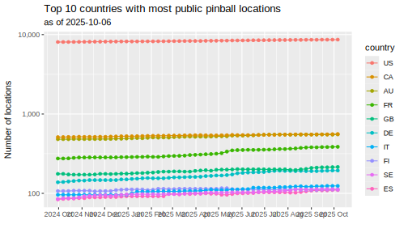

# Country-level Pinball Location Statistics Over Time

This repo is meant as a minimal example of the [git scraping](https://simonwillison.net/2020/Oct/9/git-scraping/) pattern using R. It uses [the API of pinballmap.com](https://pinballmap.com/api/v1/docs/1.0/locations/index.html) to pull down the latest country-level stats on how many public pinball locations each country has, once a week.
This data is also persisted and versioned in this very repository.



`renv` setup
-------------

The R environment was locked down with [`renv`](https://rstudio.github.io/renv/index.html) using the following commands:

```r
renv::init(bare = TRUE)
renv::install(packages = c("tidyverse", "httr2", "jsonlite", "svglite"))
renv::snapshot()
```